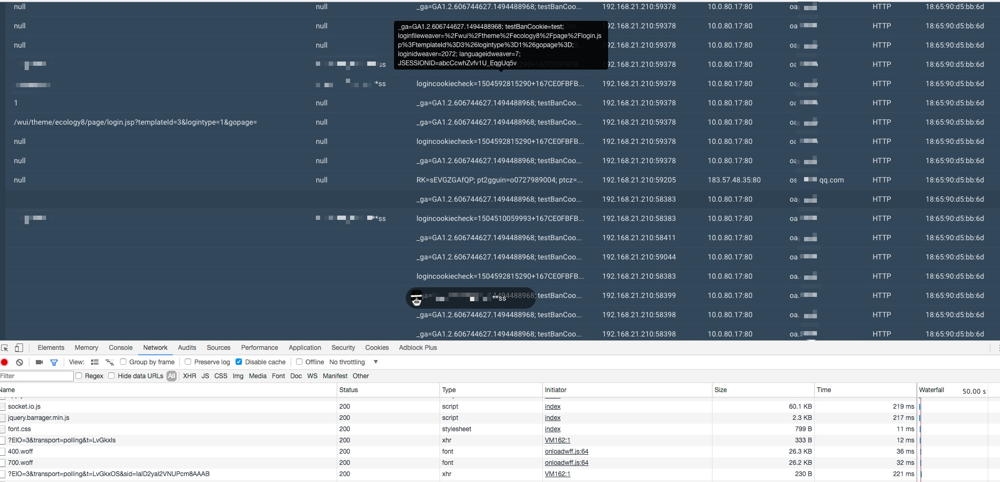

Wall of Sheep
=============
```
 _       _____    __    __       ____  ______   _____ __  __________________
| |     / /   |  / /   / /      / __ \/ ____/  / ___// / / / ____/ ____/ __ \
| | /| / / /| | / /   / /      / / / / /_      \__ \/ /_/ / __/ / __/ / /_/ /
| |/ |/ / ___ |/ /___/ /___   / /_/ / __/     ___/ / __  / /___/ /___/ ____/
|__/|__/_/  |_/_____/_____/   \____/_/       /____/_/ /_/_____/_____/_/

```
The Wall of Sheep is dedicated to network security research and we make use of a powerful API provided by [RethinkDB](http://www.rethinkdb.com/) to store and sync data in realtime.

Without SSL/TLS, your password is just like streaking. Therefore, we recommend that service provider in the list should secure their websites with HTTPS.

Installation
=============

Here is installation method.

Using brew install `Node.js`, `npm` and `rethinkdb` (option).

```
$ brew update
$ brew install node
$ brew install npm
$ brew install rethinkdb
$ npm install -g cnpm --registry=https://registry.npm.taobao.org
```

Clone the repo and change directory to `nodejs` folder.

```
$ git clone https://github.com/magerx/wallofsheeps.git
```

Packet capturing depends on [mranney/node_pcap](https://github.com/mranney/node_pcap) and save data to RethinkDB using [neumino/thinky](https://github.com/neumino/thinky) (option) you can use `npm` to get these packages.

```
$ npm install
```
trouble installing pcap?

```
$ npm install https://github.com/mranney/node_pcap.git
```
That's it.

Basic usage
=============

Two ways to use

Not saving the credentials. Start the `sniffer` with sudo

```
magerx@paxmac  ~/pentest/wallofsheep /nodejs (master)
$ sudo node sniffer.js -i en0
  _       _____    __    __       ____  ______   _____ __  __________________
| |     / /   |  / /   / /      / __ \/ ____/  / ___// / / / ____/ ____/ __ \
| | /| / / /| | / /   / /      / / / / /_      \__ \/ /_/ / __/ / __/ / /_/ /
| |/ |/ / ___ |/ /___/ /___   / /_/ / __/     ___/ / __  / /___/ /___/ ____/
|__/|__/_/  |_/_____/_____/   \____/_/       /____/_/ /_/_____/_____/_/
[INFO] [2017-07-05 14:13:45] Using interface: en0
```


Saving credentials in RethinkDB need `-s` option.

First, start the RethinkDB server like this:

```
$ rethinkdb
info: Creating directory 'rethinkdb_data'
info: Listening for intracluster connections on port 29015
info: Listening for client driver connections on port 28015
info: Listening for administrative HTTP connections on port 8080
info: Server ready
```

Second, open a new terminal and start the `sniffer` with sudo

```
magerx@paxmac  ~/pentest/wallofsheep /nodejs (master)
$ sudo node sniffer.js -i en0 -s
[INFO] [2017-07-05 14:13:45] Loading RethinkDB module.
  _       _____    __    __       ____  ______   _____ __  __________________
| |     / /   |  / /   / /      / __ \/ ____/  / ___// / / / ____/ ____/ __ \
| | /| / / /| | / /   / /      / / / / /_      \__ \/ /_/ / __/ / __/ / /_/ /
| |/ |/ / ___ |/ /___/ /___   / /_/ / __/     ___/ / __  / /___/ /___/ ____/
|__/|__/_/  |_/_____/_____/   \____/_/       /____/_/ /_/_____/_____/_/
[INFO] [2017-07-05 14:13:45] Using interface: en0
```
How to Run Web
==============

**Running web implemented in express**  
Just change directory to web, do the following command, do not forget to run rethinkdb and sniffer.js metioned above.

```
magerx@paxmac  ~/wallofsheeps/web   master ●✚  npm install & npm start
```
Now, You can wait for the comming sheep

Screenshot
===========


